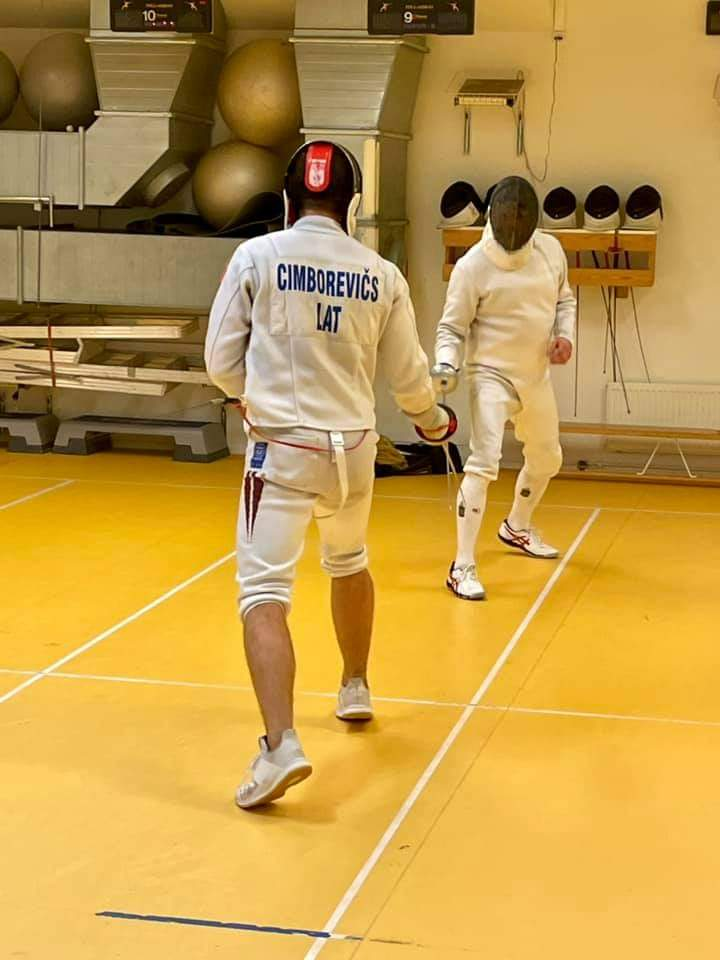

```{r setup, include=FALSE}
knitr::opts_chunk$set(echo = FALSE)
```



```{r}
# Load libraries ----------------------------------------------------------

library(tidyverse)
library(stringr)
library(here)
library(readxl)
library(kableExtra)

# Prepare data -----------------------------------------------------------

# Load data
km <- read_excel(here("data", "placeringar KM 2021.xlsx"))

# Make tidy data
km_clean <- km %>%
  # make long dataframe
  pivot_longer(!Name, names_to = "comp_no", values_to = "place") %>% 
  # get competition number
  separate(comp_no, into = c(NA, "comp_no"), sep = "KM ") %>%
  janitor::clean_names()

## Calculate points per competition

# Add new variable "points"
tot <- km_clean %>% mutate(points = case_when(
  place == 1 ~ 25,
  place == 2 ~ 22,
  place == 3 ~ 19,
  place == 4 ~ 17,
  place == 5 ~ 15,
  place == 6 ~ 13,
  place == 7 ~ 12,
  place == 8 ~ 11,
  place == 9 ~ 10,
  place == 10 ~ 9,
  place == 11 ~ 8,
  place == 12 ~ 7,
  place == 13 ~ 6,
  place == 14 ~ 5,
  place == 15 ~ 4,
  place == 16 ~ 3,
  place == 17 ~ 2,
  place >= 18 ~ 1
))

# Prepare data for the result table
df <- tot %>% 
  # filter for current competition
  filter(comp_no == 2) %>%
  select(-comp_no) %>% 
  arrange(desc(points)) %>% 
  drop_na(points) %>% 
  rename(Namn = name, Placering = place, Poäng = points)

```

## En hård kamp mellan 22 fäktare

Ytterligare en tävlingstorsdag och återigen full fart på klubben då inte mindre än 22 laddade fäktare skrev in sig protokollet! Den här gången var Grigori på plats, vilket han snabbt gjorde alla medvetna om. När kvällen var till ända hade han samlat ihop hela 20 segrar av 21 möjliga. Endast den sluga veteranhjälten CH lyckades stå emot Grigoris framfart.

Tor gjorde åter igen en gedigen insats och tog välförtjänt hem sin andra raka 2:a plats. Men många tyckte att titeln *kvällens fäktare*, trots Grigoris och Tors framfart, mycket väl skulle kunna komma Johan Ström till del. Johans entusiastiska fäktning gav honom hela 16 segrar och en imponerande 3:e placering. Grattis Johan! Ernest fäktade också bra och kunde glädja sig åt en 4:e plats.

Här har ni hela resultatlistan:

```{r}
# Create result table for current competition -----------------------------

# Create table output using kableExtra package
kable(df) %>%
  kable_styling(bootstrap_options = "striped", full_width = F, position = "left")
```

Väldigt glädjande att se att allt fler av de unga fäktarna ställer upp. Bra jobbat av Ian, Olivia, Hugo, Francesco, Eden, Selma, Sebastian och Teodor!

## Totalställningen

Låt oss titta på totalställningen:

```{r}
# Create overall standings table ------------------------------------------

## Calculate grand total points for all competitions (1-2)
grand_tot <- tot %>% group_by(name) %>%
  summarise(sum_points = sum(points, na.rm = TRUE)) %>% 
  arrange(desc(sum_points))
View(grand_tot)

##  Change format for output - create "pivot table" with points per competition
piv_comp <- tot %>% 
  select(name, comp_no, points) %>% 
  pivot_wider(names_from = comp_no, values_from = points, names_prefix = "comp_") %>% 
  select(!(comp_3:comp_5))
# View(piv_comp)

# Create new piv df with totals column
res <- piv_comp %>%
  full_join(grand_tot, by = "name") %>% 
  arrange(desc(sum_points))

# Add ranking
res <- res %>% mutate(rank = min_rank(desc(sum_points)))

# Relocate variables
res <- res %>% relocate(rank, .before = name)

# Rename columns for final table Note: change for each competition!!
standings <- res %>% rename("#" = "rank", "Namn" = "name", 
                            "1" = "comp_1", "2" = "comp_2",
                            "Summa Poäng" = "sum_points")

# Create tabel output using kableExtra package
kable(standings) %>%
  kable_styling(bootstrap_options = "striped", full_width = F, position = "left")
```

Som så vanligt i KM-sammanhang är Tors namn högst upp på listan, med ett litet avstånd till Karsten. FFF:s sportchefer är inte att leka med! Därefter är det jämt om 3:e platsen som delas av Ernest och Johan S, som båda skuggas av CH.

Åsa gjorde, som vanligt bra ifrån sig och är med på top-10-listan. Hon kommer säkert att fortsätta klättra ännu högre.

> Fortsätt att träna hårt, så ses vi när det drar ihop sig till nästa drabbning den **21 oktober**, då deltävling 3 exploderar!
